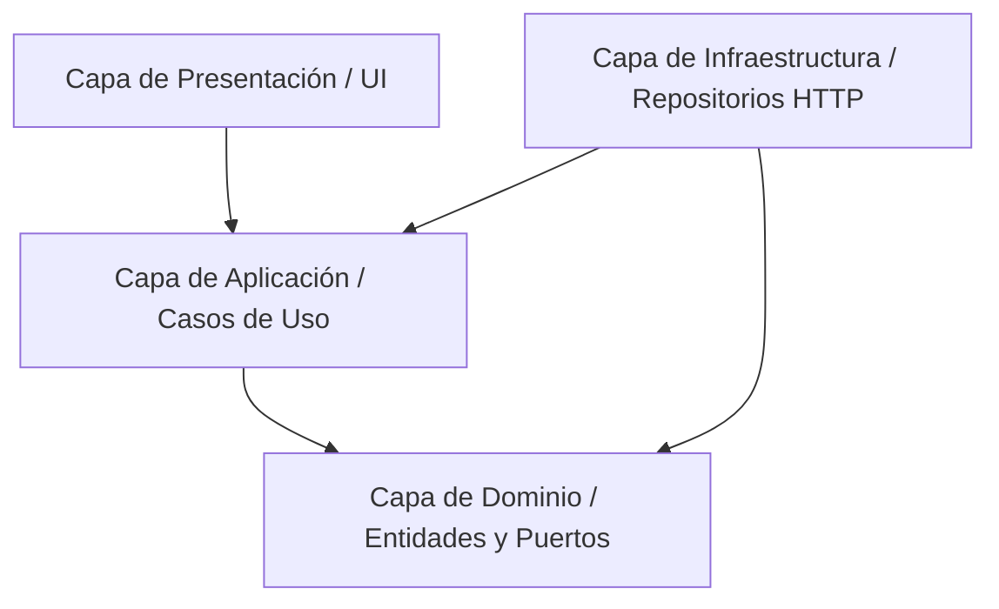

# 📜 Constitución del Proyecto: Reglas de Desarrollo

Este documento define las directrices, estándares de codificación y arquitectura para el desarrollo del frontend de **CEISH Espoch**. Es obligatorio seguir estas reglas para garantizar la mantenibilidad, escalabilidad y coherencia del proyecto.

---

## 🏛️ 1. Arquitectura y Capas (Clean Architecture & DDD)

El proyecto sigue una arquitectura limpia (Clean Architecture) combinada con Diseño Guiado por el Dominio (DDD). La estructura del código está estrictamente dividida en las siguientes capas dentro de `src/`:

### 1.1 Dominio (`src/domain/`)
* **Propósito:** Contiene las reglas de negocio principales, entidades, objetos de valor y puertos de repositorio. Es agnóstico a Angular y frameworks.
* **Regla:** No debe importar nada de `@angular/*` ni depender de la capa de infraestructura o presentación.
* **Componentes principales:**
  * **Entidades:** Modelos de negocio con identidad única (`*.entity.ts`).
  * **Puertos de Repositorio (Interfaces):** Definen los contratos de datos (`*-repository.port.ts`).
  * **Objetos de Valor (Value Objects):** Atributos sin identidad pero con reglas específicas (`*.vo.ts`).
  * **Enums:** Enumeraciones del sistema (`*.enum.ts`).

### 1.2 Infraestructura (`src/infrastructure/`)
* **Propósito:** Implementaciones técnicas específicas, acceso a red (HTTP), almacenamiento, mapeadores y configuraciones del framework.
* **Componentes principales:**
  * **Repositorios:** Implementan los puertos definidos en el dominio (`*-http.repository.ts`).
  * **Mapeadores:** Convierten DTOs de API externa a Entidades de Dominio y viceversa (`*.mapper.ts`).
  * **Servicios de Framework:** Integración con servicios externos o librerías de Angular.
  * **Guards & Interceptors:** Lógica de seguridad y control de red.

### 1.3 Aplicación / Características (`src/features/`)
* **Propósito:** Orquestación de lógica específica por módulos y casos de uso del sistema. Cada módulo contiene sus propios Casos de Uso y su Capa de Presentación.
* **Estructura Interna por Feature:**
  * `application/use-cases/`: Casos de uso específicos que consumen puertos de repositorio.
  * `presentation/pages/`: Páginas enrutables de la característica.
  * `presentation/components/`: Componentes específicos de la característica.
  * `routes.ts`: Definición de rutas específicas de la característica.

### 1.4 Compartidos (`src/shared/`)
* **Propósito:** Componentes UI reutilizables, directivas, pipes y utilidades comunes a múltiples características.

---

## 🏷️ 2. Convenciones de Nomenclatura

Para mantener la uniformidad, se deben seguir estrictamente los siguientes sufijos y estilos de nombres:

| Tipo de Archivo | Sufijo del Archivo | Ejemplo de Nombre |
| :--- | :--- | :--- |
| **Entidad** | `.entity.ts` | `protocol.entity.ts` |
| **Puerto de Repositorio** | `-repository.port.ts` | `protocol-repository.port.ts` |
| **Implementación HTTP** | `-http.repository.ts` | `protocol-http.repository.ts` |
| **Caso de Uso** | `.use-case.ts` | `submit-protocol.use-case.ts` |
| **Mapeador** | `.mapper.ts` | `protocol.mapper.ts` |
| **Objeto de Valor** | `.vo.ts` | `email.vo.ts` |
| **Componente de Página** | `.page.ts` | `protocol-detail.page.ts` |
| **Componente UI** | `.component.ts` | `checklist.component.ts` |
| **Enum** | `.enum.ts` | `protocol-status.enum.ts` |

---

## 🧩 3. Inyección de Dependencias y Desacoplamiento

* **Principio de Inversión de Dependencias (DIP):** Los componentes de presentación y los casos de uso deben depender siempre de la **interface** (Puerto) definida en el Dominio, y **nunca** de la implementación concreta de Infraestructura (HTTP Repository).
* **Configuración del Inyector:** Registre los repositorios a través de tokens en los proveedores de configuración para que se resuelvan de forma dinámica.
* **Tipado Estricto:** Está prohibido el uso de `any` excepto en integraciones heredadas o librerías de terceros sin tipado. Todo objeto debe mapearse a su correspondiente entidad o DTO tipado.

---

## 🎨 4. Estilos y Estructura CSS

* **Tecnología:** Se utiliza **SCSS (Sass)** como preprocesador de CSS principal.
* **Componentes encapsulados:** Cada componente debe tener su propio archivo de estilo encapsulado (`styleUrls` o `styleUrl`).
* **Variables globales:** Las variables de paleta de colores, fuentes, espaciados y breakpoints se importan desde `src/styles/` mediante mixins o variables globales CSS.
* **TailwindCSS:** Evitar el uso de TailwindCSS en este proyecto a menos que se configure explícitamente en el futuro. Todo el styling debe ser SCSS modularizado.

---

## ⚙️ 5. Gestión del Estado y RxJS

* **Programación Reactiva:** Utilizar RxJS para la gestión de flujos de datos asíncronos en servicios de infraestructura y casos de uso.
* **Signals:** Utilizar Angular Signals en la capa de presentación para la reactividad de la vista y la simplificación de variables de estado local.
* **Manejo de Memoria:** Evitar fugas de memoria (memory leaks) completando las suscripciones de observables mediante o usando el pipe `async` en las plantillas HTML.

---

## 📝 6. Flujo de Git y Commits

* **Mensajes de Commit:** Seguir la especificación de Commits Convencionales:
  * `feat: ...` para nuevas funcionalidades.
  * `fix: ...` para corrección de bugs.
  * `docs: ...` para cambios en documentación.
  * `style: ...` para cambios estéticos que no afectan la lógica.
  * `refactor: ...` para reestructuraciones de código.
* **Ramas:**
  * `main`: Código estable en producción.
  * `develop`: Integración de características probadas.
  * `feature/*`: Desarrollo de nuevas características o iteraciones.

---

## 🚀 7. Ciclo de Vida del Desarrollo e Implementación (Fases y Calidad)

Todo ciclo de iteración, desarrollo e implementación de código en este proyecto debe regirse obligatoriamente por una metodología estructurada en 3 fases y superar los controles de calidad técnica establecidos.

### 7.1 Las 3 Fases del Ciclo de Desarrollo
Cualquier tarea de desarrollo o implementación se ejecuta a través del siguiente proceso secuencial:

1. **Fase 1: Especificación y Diseño Técnico (Planificación):**
   * Comprender el flujo funcional y documentar las firmas de los endpoints involucrados.
   * Diseñar o actualizar las interfaces de repositorio (`*-repository.port.ts`) y modelos de dominio involucrados.
   * Planificar las vistas o maquetas del frontend y definir la interacción lógica.
2. **Fase 2: Codificación y Construcción (Desarrollo):**
   * Desarrollar la lógica en las capas de Dominio, Aplicación, Infraestructura y Presentación.
   * Aplicar convenciones de código estricto, inyección de dependencias y estilos SCSS encapsulados.
3. **Fase 3: Validación y Aseguramiento (Cierre):**
   * Desarrollar y ejecutar las pruebas automáticas.
   * Evaluar métricas estáticas de calidad y realizar el flujo completo de QA manual antes del despliegue o fusión de código.

### 7.2 Requisitos y Controles de Calidad Obligatorios
Ningún código desarrollado podrá ser incorporado a la rama de integración (`develop`) sin cumplir con los siguientes criterios:

#### 🧪 A. Pruebas Unitarias (Unit Tests)
* **Cobertura:** Todo nuevo componente, caso de uso, servicio de infraestructura o mapeador desarrollado debe incluir sus correspondientes pruebas unitarias (`*.spec.ts`).
* **Límites:** Se exige una cobertura de código (Code Coverage) mínima del **80%** en el código nuevo e implementaciones modificadas.
* **Aislamiento:** Los repositorios e integraciones externas en las pruebas deben ser mockeados utilizando el `HttpClientTestingModule` o espías de Jasmine/Karma para evitar dependencias externas.

#### 📊 B. Métricas de Calidad (Quality Metrics)
* **Tipado Estricto:** Prohibido el uso de `any`. Las variables y retornos de funciones deben estar explícitamente tipados.
* **Complejidad Ciclomática:** Funciones individuales no deben superar una complejidad ciclomática de 10. Si superan este límite, la lógica debe ser refactorizada o dividida en submétodos.
* **Análisis Estático (Linting):** Ejecución limpia de `ng lint` (o ESLint configurado) sin advertencias (warnings) ni errores.
* **Duplicidad:** Cumplir estrictamente el principio **DRY (Don't Repeat Yourself)**. Bloques repetidos de UI o lógica de servicio deben extraerse a componentes compartidos o helpers en `src/shared/`.

#### 🔍 C. Procedimientos de QA (QA Procedures)
* **Verificación de Flujo Completo:** Simular escenarios alternativos de fallo en local (ej. pérdida de conexión, timeouts, errores de concurrencia `HTTP 409`, archivos dañados en la carga).
* **Code Review (Revisión por Pares):** Al menos un desarrollador del equipo debe validar el Pull Request (PR) verificando el cumplimiento de la Clean Architecture descrita en esta constitución.
* **QA UX/UI:** Verificación de la responsividad del diseño en resoluciones móviles, tablets y escritorio antes de proceder al merge.

