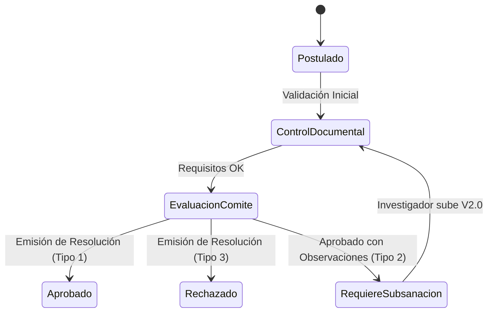

# 📋 Especificación Funcional: CEISH Espoch (Iteración 2)

Este documento detalla el alcance funcional, los roles de usuario y las reglas de negocio implementadas en la **Iteración 2** de la plataforma CEISH Espoch.

---

## 🎯 1. Propósito de la Plataforma

La plataforma de **CEISH Espoch** automatiza el ciclo de vida de la evaluación ético-científica de protocolos de investigación en seres humanos. Permite la postulación, revisión documental, evaluación por pares, emisión de resoluciones y control de subsanaciones.

---

## 👥 2. Roles del Sistema

El sistema gestiona cuatro roles principales con permisos diferenciados:

1. **Investigador Principal (IP):**
   * Registra y postula protocolos de investigación.
   * Carga los requisitos documentales exigidos por el comité.
   * Visualiza el historial y estado de sus protocolos.
   * Realiza la carga de correcciones (subsanaciones) cuando su protocolo es observado.

2. **Secretaría CEISH:**
   * Realiza el control documental de los protocolos postulados (revisión de requisitos).
   * Aprueba o devuelve requisitos específicos con observaciones.
   * Asigna códigos CEISH a expedientes aprobados para evaluación.
   * Apoya en el registro de resoluciones oficiales del comité.

3. **Comité Evaluador (Miembros del CEISH):**
   * Realiza la evaluación técnica y ética de los protocolos.
   * Emite el dictamen final (Resolución).
   * Visualiza y descarga expedientes completos de investigación.

4. **Evaluadores Externos / Pares:**
   * Emiten dictámenes de pares ciegos sobre protocolos asignados por secretaría/comité.

---

## 🔄 3. Flujo de Trabajo Detallado (Iteración 2)

La Iteración 2 introduce cambios sustanciales en el ciclo de vida y control de versiones de un protocolo:

### 3.1 Catálogo Simplificado de Resoluciones
Se elimina el tipo de resolución `4` (`PENDIENTE_SUBSANACION`). Ahora la única vía para exigir correcciones al investigador es:
* **Tipo 2: `APROBADO_CON_OBSERVACIONES`**

Al seleccionar esta opción, el sistema requiere capturar:
* Observaciones mayores.
* Observaciones menores.
* Procedimiento de subsanación.

### 3.2 Proceso de Carga de Subsanaciones (Versión 2.0+)
Cuando un protocolo recibe una resolución Tipo 2:
1. El protocolo cambia a estado general **`21`** (`EN_CONTROL_DOCUMENTAL`) y la recepción se establece en estado **`9`** (`INICIADO`).
2. El sistema detecta que es una **fase de carga de nueva versión** (ej: V2.0).
3. **Inmutabilidad de requisitos aprobados:** Los documentos que ya fueron marcados como `APROBADO` o `NO_APLICA` en la versión anterior quedan bloqueados y no se pueden re-editar ni volver a subir.
4. **Habilitación de requisitos observados:** Los documentos rechazados u observados se resetean automáticamente a `NO_PRESENTADO` en el backend. La interfaz de carga debe activarse únicamente para estos documentos, permitiendo al investigador subir el nuevo archivo corregido.

### 3.3 Control de Concurrencia (Optimistic Locking)
* **El Problema:** Dos secretarios o un secretario y un miembro de comité podrían intentar modificar el estado de un protocolo al mismo tiempo.
* **La Solución:** El backend implementa control de concurrencia optimista. Si se intenta guardar una resolución sobre una versión de expediente que ya cambió, la API retorna un error **HTTP 409 Conflict**.
* **Frontend:** El frontend debe capturar el error `409` y mostrar un modal que explique al usuario que los datos fueron modificados concurrentemente y debe recargar la página.

### 3.4 Historial y Línea de Tiempo de Versiones
* El expediente del protocolo almacena un array histórico de versiones.
* La línea de tiempo debe reflejar visualmente las transiciones.
* Si una versión previa estuvo en estado **`19`** (`REQUIERE_SUBSANACION_VERSION`), la línea de tiempo debe permitir expandir los detalles de esa versión para consultar las observaciones históricas y la resolución consolidada que dio origen a la subsanación.
